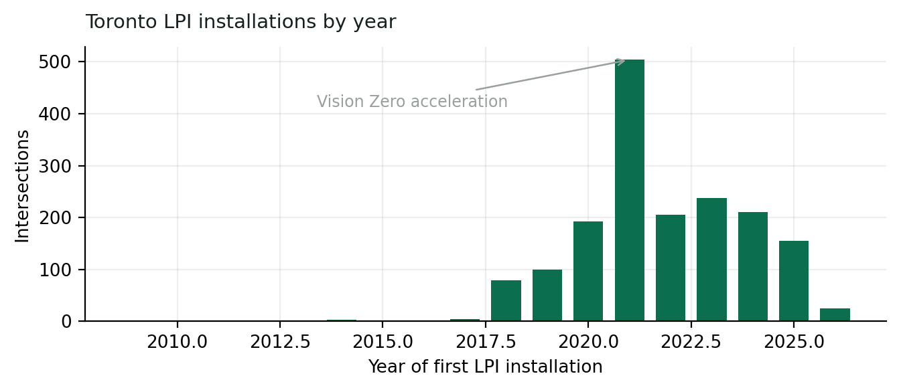
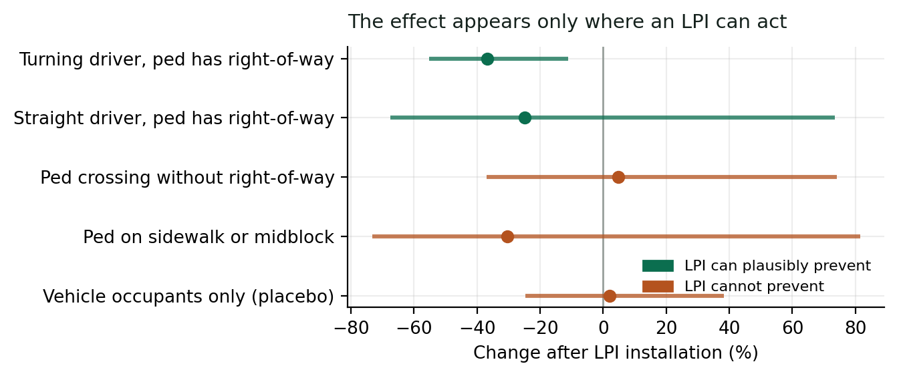
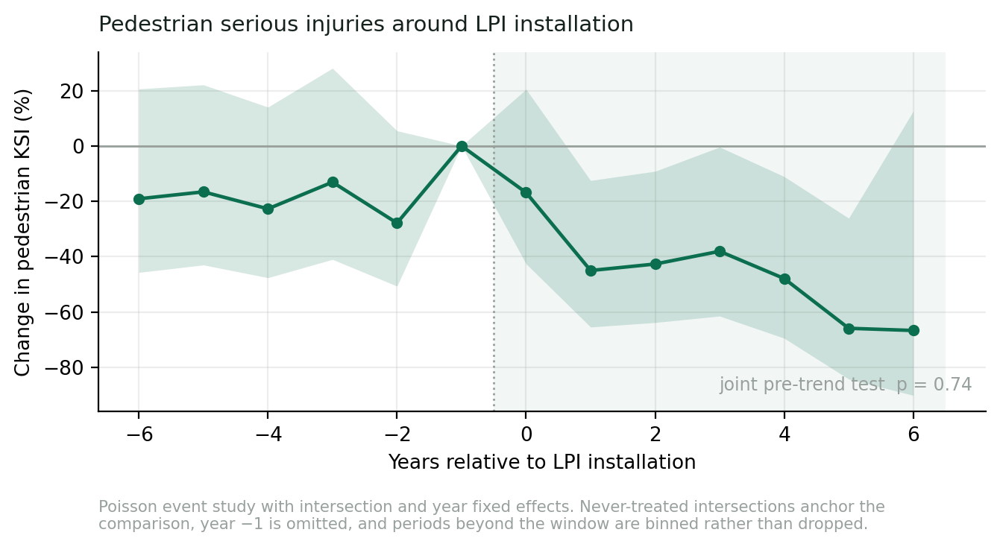
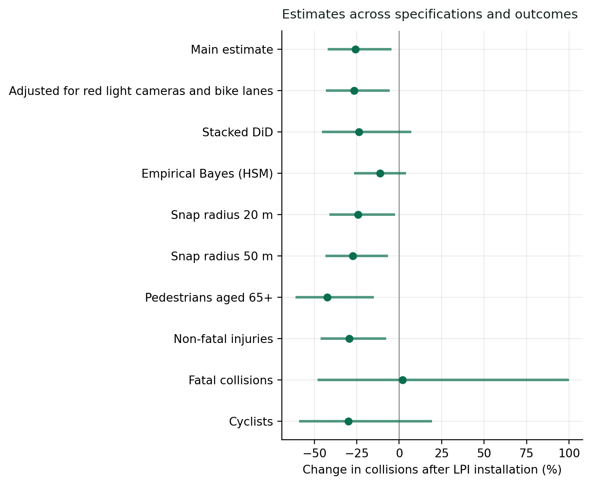
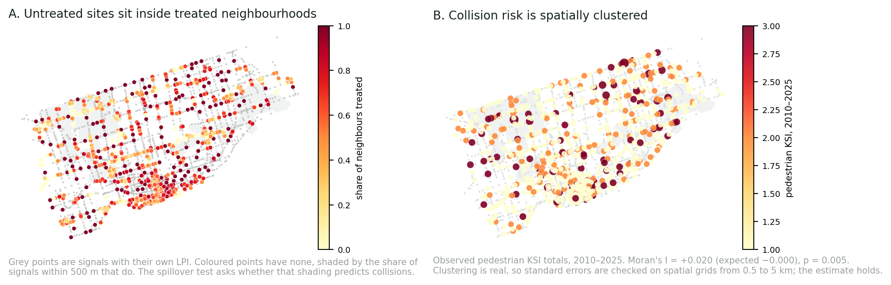
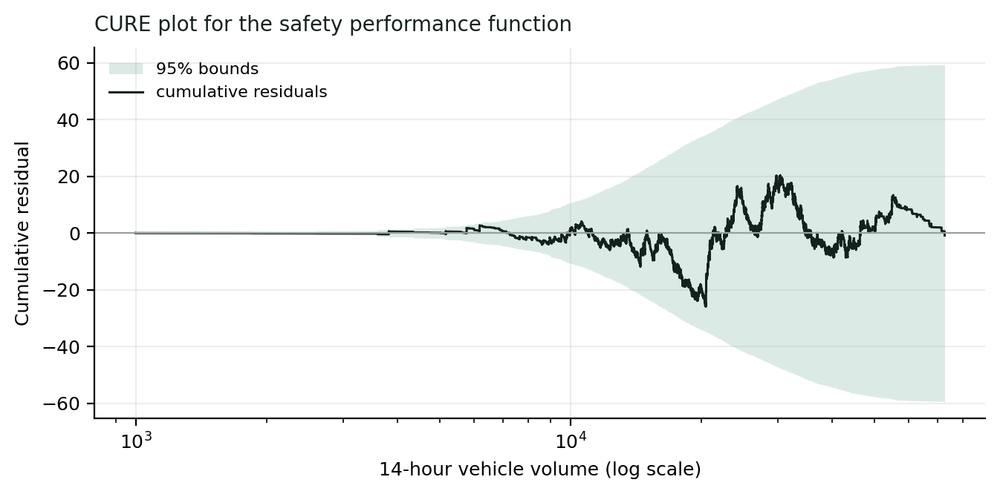

# Did Toronto's leading pedestrian intervals work?

## The problem

A leading pedestrian interval (LPI) gives people on foot a head start: the walk
signal comes on a few seconds before parallel traffic gets green, so pedestrians are
in the crosswalk, and in turning drivers' sight lines, before vehicles start moving.

Toronto has installed LPIs at **1,721 signalized intersections since 2009**, most of
them under Vision Zero after 2019, and has never published an evaluation of whether
they reduced injuries. Because the rollout was staggered across intersections over
fifteen years, intersections not yet treated in a given year form a natural
comparison group for those already treated.

## Data

All public, nothing purchased:

| Source | Role |
|---|---|
| Traffic Signals inventory (City of Toronto) | LPI installation dates per approach, locations |
| KSI collisions (City of Toronto) | killed-or-seriously-injured outcomes, 2006–2026 |
| All-severity collisions (Toronto Police Service) | independent injury outcome, 9,352 events |
| Turning movement counts, full history | pedestrian & vehicle exposure, 7,552 counts |
| Red light cameras, cycling network | dated co-treatment controls |

Collisions were matched to signals geometrically (98% within 30 m). The analysis
panel: **2,543 intersections × 2010–2025 = 37,799 intersection-years**.

## Methods

- **Difference-in-differences**: Poisson regression with intersection and year fixed
  effects, standard errors clustered by intersection. Intersection effects absorb
  everything permanent about a site; year effects absorb citywide shocks.
- **Event study** with binned endpoints and a joint pre-trend test.
- **Mechanism split**: Toronto codes *how* each collision occurred, so the outcome can
  be split into configurations an LPI can physically prevent and ones it cannot,
  plus a placebo (vehicle-occupant collisions).
- **Empirical Bayes before-after** (Highway Safety Manual): a negative-binomial
  safety performance function fitted on 26,687 untreated intersection-years, CURE-plot
  validated, correcting for regression to the mean.
- **Robustness**: stacked DiD for staggered adoption, randomization inference,
  Holm-Bonferroni over a declared primary family, spatial spillover and
  autocorrelation tests, snap-radius and bandwidth sensitivity, time-varying volume
  controls.

## Results

**The effect appears only where an LPI can act.** Collisions where a turning driver
struck a pedestrian with right-of-way fell **37%**. Collisions the treatment cannot
prevent, such as pedestrians crossing without right-of-way or vehicle occupants, did
not move.

**The drop follows installation, not the other way around.** Pre-treatment years are
flat (joint pre-trend test p = 0.74); the reduction appears at installation and
persists for at least four years.

**It holds across every specification tried**: co-treatment controls, stacked DiD,
Empirical Bayes, spatial clustering, snap radii, volume controls, and an independent
all-severity outcome from police data (−10.7%, the tightest interval in the study).

**Spatially**: collision risk clusters, but the estimate survives spatially clustered
standard errors from 0.5 to 5 km, and untreated neighbours of treated sites show no
spillover.

**The practical number**: Empirical Bayes crash modification factor **0.89**, the
figure a city should use for appraisal, smaller than the raw −25.8% because Toronto
installs where collisions just happened (selection measured directly: OR 1.33 on the
prior year).

## Limitations

- The aggregate effect does not survive multiplicity correction across the primary
  family; the mechanism (−37%, adj. p = 0.042) and older-pedestrian (−42%, adj.
  p = 0.034) results do.
- The mechanism and falsification effects are not statistically separable on a common
  sample (p = 0.10): corroborative, not decisive.
- No dated open data exists for speed limits or ASE cameras, so those co-treatments
  are uncontrolled.

## Code and reproduction

Analysis in Python (pandas, pyfixest, statsmodels). All data sources are public and
listed above; code available on request.
